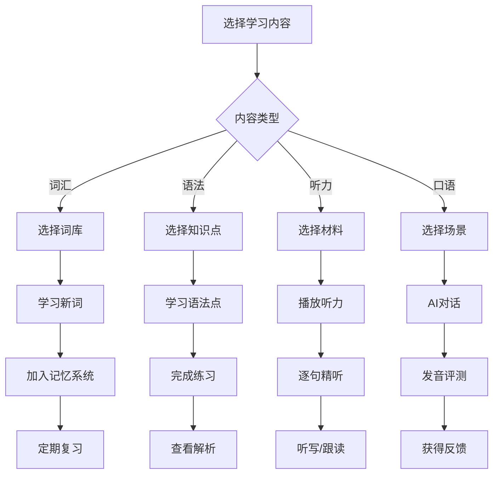
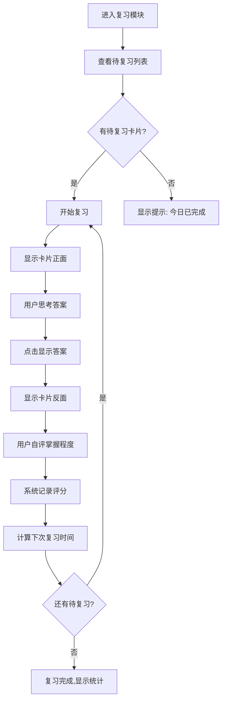
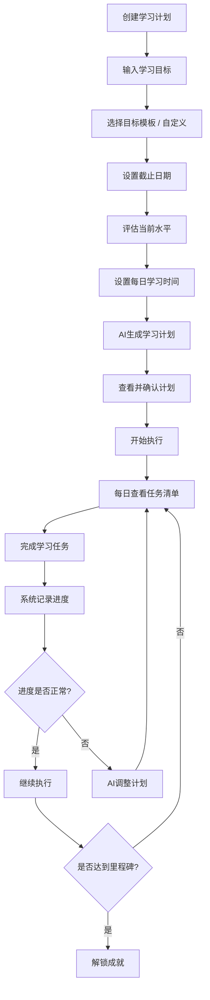
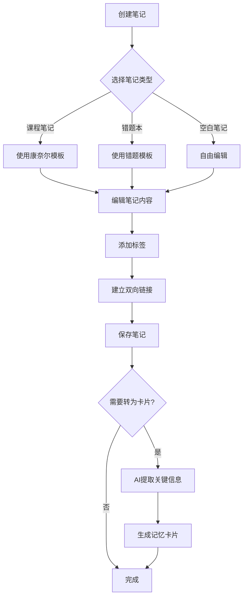
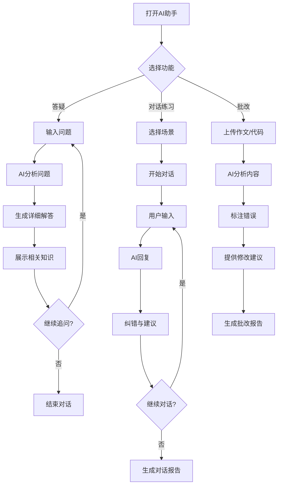

# AI学习助手 - 产品规划与需求分析文档

> **文档版本**: V1.0  
> **创建日期**: 2024年12月  
> **产品定位**: 陪你学、帮你记、替你规划的AI学习系统

---

## 目录
1. [产品概述](#1-产品概述)
2. [市场分析](#2-市场分析)
3. [用户研究](#3-用户研究)
4. [产品定位与策略](#4-产品定位与策略)
5. [产品架构](#5-产品架构)
6. [核心功能设计](#6-核心功能设计)
7. [MVP功能清单](#7-mvp功能清单)
8. [产品路线图](#8-产品路线图)
9. [技术架构建议](#9-技术架构建议)
10. [数据指标体系](#10-数据指标体系)
11. [商业模式设计](#11-商业模式设计)
12. [风险与挑战](#12-风险与挑战)

---

## 1. 产品概述

### 1.1 产品愿景
打造一个AI驱动的全场景学习平台，通过科学的记忆算法、智能学习规划和个性化辅导，帮助用户高效掌握语言和知识，建立可持续的学习习惯。

### 1.2 核心价值主张
**一句话描述**: 真正能陪你学、帮你记、替你规划的AI学习系统

**三大核心价值**:
- **科学记忆**: 基于遗忘曲线的智能复习系统
- **AI辅导**: 24小时在线的个性化学习助手
- **系统化**: 从规划到执行到复盘的完整闭环

### 1.3 产品形态
- **Web端**: 适合深度学习和内容管理
- **移动端**: 适合碎片化学习和随时复习

---

## 2. 市场分析

### 2.1 市场规模
- **在线教育市场**: 2024年中国在线教育市场规模预计达5000亿+
- **语言学习市场**: 约1500亿，年增长率15%+
- **知识付费市场**: 持续增长，用户付费意愿提升

### 2.2 竞品分析

| 竞品 | 核心功能 | 优势 | 劣势 | 我们的差异化 |
|------|---------|------|------|-------------|
| **Duolingo** | 游戏化语言学习 | 趣味性强、用户基数大 | 缺乏深度学习、系统性不足 | 多领域整合+AI个性化指导 |
| **Anki** | 间隔重复记忆 | 记忆算法成熟、自由度高 | 学习曲线陡峭、UI陈旧 | 智能化+更好的用户体验 |
| **Notion** | 笔记与知识管理 | 灵活性强、功能丰富 | 学习功能弱、无AI辅导 | 学习场景深度优化 |
| **扇贝单词** | 英语单词记忆 | 社区氛围好、打卡机制 | 单一功能、缺乏规划 | 全流程学习体系 |
| **有道/百词斩** | 词汇学习工具 | 资源丰富、品牌知名度 | 创新不足、AI应用浅 | 深度AI能力整合 |

### 2.3 市场机会
1. **AI技术成熟**: 大模型能力可深度应用于学习场景
2. **用户痛点明确**: 现有产品碎片化,缺乏一体化解决方案
3. **付费意愿提升**: 用户愿意为高质量学习工具付费
4. **市场空白**: 多领域+系统化+AI深度整合的产品较少

---

## 3. 用户研究

### 3.1 目标用户群体

#### 主力用户群 (70%)
**大学生 & 考研/留学群体**
- 年龄: 18-25岁
- 特征: 有明确学习目标、时间相对充裕、接受新技术快
- 需求: 英语四六级/雅思托福备考、专业知识学习、考研规划
- 痛点: 自制力不足、缺乏系统规划、复习效率低

**职场白领**
- 年龄: 25-35岁
- 特征: 碎片化时间、追求效率、有一定付费能力
- 需求: 职场英语提升、技能学习(编程等)、知识管理
- 痛点: 时间有限、学习不成体系、难以坚持

#### 次要用户群 (30%)
**自律型终身学习者**
- 年龄: 不限
- 特征: 自我驱动强、追求深度学习、愿意尝试新方法
- 需求: 多语言学习、知识体系构建、学习方法优化
- 痛点: 工具分散、数据不互通、缺乏智能化

### 3.2 用户画像

#### 画像1: 考研学生 - 李明
- **基本信息**: 22岁，大三学生，准备考研
- **学习目标**: 英语70+、专业课250+
- **典型场景**: 
  - 每天背200个考研单词，但经常忘记复习
  - 想系统规划复习进度，但不知从何下手
  - 希望有人能督促和指导
- **核心需求**: 智能规划、科学复习、进度追踪

#### 画像2: 职场白领 - 王芳
- **基本信息**: 28岁，互联网产品经理
- **学习目标**: 提升英语口语、学习Python
- **典型场景**:
  - 通勤路上想学习，但内容碎片化
  - 工作笔记散落各处，难以整理
  - 想学编程但没有系统路径
- **核心需求**: 碎片化学习、知识管理、AI答疑

#### 画像3: 留学准备者 - 张伟
- **基本信息**: 24岁，准备出国读研
- **学习目标**: 雅思7.5+、GRE320+
- **典型场景**:
  - 需要大量词汇积累和口语练习
  - 希望看到明确的学习进度和效果
  - 愿意付费获得更好的学习工具
- **核心需求**: 高效记忆、个性化训练、数据可视化

### 3.3 用户需求优先级

| 需求类型 | 具体需求 | 优先级 | MVP包含 |
|---------|---------|--------|---------|
| **核心需求** | 科学记忆复习 | P0 | ✅ |
| **核心需求** | AI智能答疑 | P0 | ✅ |
| **核心需求** | 学习规划 | P0 | ✅ |
| **重要需求** | 笔记记录整理 | P1 | ✅ |
| **重要需求** | 学习数据统计 | P1 | ✅ |
| **期望需求** | 社区互动 | P2 | ❌ |
| **期望需求** | 学习小组 | P2 | ❌ |
| **次要需求** | 游戏化激励 | P3 | 部分 |

---

## 4. 产品定位与策略

### 4.1 产品定位
**AI驱动的全场景学习平台** —— 覆盖"学-记-测-管"的完整学习闭环

### 4.2 差异化策略

#### 核心差异点
1. **多领域整合**: 不只是单词App或笔记App,而是完整学习系统
2. **AI深度应用**: 不是简单的GPT接入,而是深度场景化的AI能力
3. **科学方法论**: 基于认知科学的记忆算法和学习规划
4. **数据驱动**: 可量化、可追踪的学习进度和效果

#### 竞争壁垒
- **算法壁垒**: 个性化的记忆曲线和学习推荐算法
- **内容壁垒**: 高质量的学习资源和AI训练数据
- **体验壁垒**: 流畅的学习体验和习惯养成机制
- **数据壁垒**: 用户学习数据的积累和分析能力

### 4.3 产品策略

#### 冷启动策略
1. **内容先行**: 先准备高质量的语言学习资源库
2. **垂直切入**: 先聚焦考研/雅思等明确场景
3. **种子用户**: 通过校园渠道和学习社区获取早期用户
4. **口碑传播**: 打磨产品体验,鼓励用户分享学习成果

#### 增长策略
1. **免费增值模型**: 核心功能免费,高级功能订阅
2. **社交裂变**: 学习打卡、成就分享、邀请奖励
3. **内容营销**: 学习方法论、干货分享、成功案例
4. **渠道合作**: 与培训机构、学校、企业合作

---

## 5. 产品架构

### 5.1 功能架构图

```
AI学习助手
│
├── 1. 学习中心 (Learning Hub)
│   ├── 语言学习
│   │   ├── 单词/词汇
│   │   ├── 语法
│   │   ├── 听力
│   │   ├── 口语
│   │   └── 阅读/写作
│   ├── 编程学习
│   │   ├── 语言基础
│   │   ├── 练习题库
│   │   └── 项目实战
│   └── 自定义学习
│       └── 导入个人学习内容
│
├── 2. 记忆系统 (Memory System)
│   ├── 智能复习
│   │   ├── 间隔重复算法
│   │   ├── 遗忘曲线预测
│   │   └── 优先级排序
│   ├── 卡片管理
│   │   ├── 创建/编辑卡片
│   │   ├── 卡片分组
│   │   └── 导入/导出
│   └── 复习模式
│       ├── 标准复习
│       ├── 快速复习
│       └── 测试模式
│
├── 3. 学习规划 (Planning)
│   ├── 目标设定
│   │   ├── 短期目标
│   │   ├── 中期目标
│   │   └── 长期目标
│   ├── 智能排期
│   │   ├── AI生成学习计划
│   │   ├── 自动调整进度
│   │   └── 任务提醒
│   └── 进度追踪
│       ├── 完成度统计
│       ├── 时间分配分析
│       └── 效率评估
│
├── 4. 笔记系统 (Note-taking)
│   ├── 笔记编辑
│   │   ├── Markdown编辑器
│   │   ├── 富文本支持
│   │   └── 代码高亮
│   ├── 知识组织
│   │   ├── 文件夹/标签
│   │   ├── 双向链接
│   │   └── 知识图谱
│   └── 学习笔记
│       ├── 课程笔记
│       ├── 错题本
│       └── 灵感收集
│
├── 5. AI助手 (AI Assistant)
│   ├── 智能答疑
│   │   ├── 问题解答
│   │   ├── 知识点讲解
│   │   └── 相关推荐
│   ├── 学习陪伴
│   │   ├── 对话练习
│   │   ├── 作文批改
│   │   └── 口语评测
│   └── 个性化推荐
│       ├── 学习内容推荐
│       ├── 复习时机提醒
│       └── 方法建议
│
└── 6. 数据中心 (Analytics)
    ├── 学习报告
    │   ├── 日报/周报/月报
    │   ├── 学习时长统计
    │   └── 掌握度分析
    ├── 数据可视化
    │   ├── 进度曲线
    │   ├── 复习热力图
    │   └── 成就展示
    └── 学习洞察
        ├── 学习习惯分析
        ├── 薄弱环节识别
        └── 改进建议
```

### 5.2 信息架构

#### Web端信息架构
```
顶部导航栏
├── Logo
├── 今日学习 (快捷入口)
├── 记忆复习 (待复习数量badge)
├── 学习规划
├── 我的笔记
├── AI助手
└── 个人中心

侧边栏 (可折叠)
├── 快速访问
├── 最近使用
├── 学习项目列表
└── 标签/分类

主内容区
└── 根据不同模块动态展示
```

#### 移动端信息架构
```
底部Tab导航
├── 学习 (首页)
├── 复习
├── 计划
├── 笔记
└── 我的

首页 (学习中心)
├── 今日任务卡片
├── 继续学习
├── 推荐内容
└── 学习统计概览
```

---

## 6. 核心功能设计

### 6.1 语言学习模块

#### 6.1.1 功能描述
提供英语、日语等多语言的系统化学习内容,覆盖词汇、语法、听说读写全方位能力培养。

#### 6.1.2 核心子功能

**1) 词汇学习**
- **词库管理**
  - 预设词库: 四六级、考研、雅思、托福等
  - 自定义词库: 用户自建词汇表
  - 导入功能: 支持从文本/Excel导入
  
- **学习模式**
  - 新词学习: 词义、例句、发音、词根词缀
  - 场景学习: 结合真实语境的例句
  - 图片联想: 配合图片增强记忆
  
- **测试模式**
  - 英译中/中译英
  - 拼写测试
  - 听力辨识
  - 例句填空

**2) 语法学习**
- 语法知识点树
- 互动练习题
- 错题自动收集
- AI语法检查

**3) 听力训练**
- 听力材料库 (新闻、对话、讲座)
- 逐句精听
- 变速播放
- 听写练习
- AI发音对比

**4) 口语练习**
- AI对话练习
- 场景模拟 (面试、旅游、商务)
- 发音评测
- 流利度分析
- 录音回放与对比

**5) 阅读/写作**
- 文章精读
- 长难句分析
- 写作题库
- AI作文批改
- 词汇/语法错误标注

#### 6.1.3 用户流程



#### 6.1.4 数据结构示例

```javascript
// 词汇数据结构
{
  "word": "persevere",
  "phoneticUS": "/ˌpɜːrsəˈvɪr/",
  "phoneticUK": "/ˌpɜːsɪˈvɪə/",
  "meanings": [
    {
      "partOfSpeech": "v.",
      "definition": "坚持;不屈不挠",
      "examples": [
        "You must persevere with your English studies.",
        "She persevered in her efforts to win the championship."
      ]
    }
  ],
  "rootWords": {
    "per": "完全",
    "severe": "严厉"
  },
  "synonyms": ["persist", "continue", "endure"],
  "images": ["image_url"],
  "audioUS": "audio_url",
  "audioUK": "audio_url",
  "difficulty": 5,
  "frequency": 4,
  "tags": ["考研", "CET6"]
}
```

---

### 6.2 记忆强化模块

#### 6.2.1 功能描述
基于科学的间隔重复算法(Spaced Repetition),智能安排复习时间,最大化长期记忆效果。

#### 6.2.2 核心算法: 改进版SM-2算法

**原理说明**:
- 根据每次复习的表现,动态调整下次复习间隔
- 容易遗忘的内容增加复习频率
- 熟练掌握的内容延长复习间隔

**间隔计算公式**:
```
if 首次复习:
    间隔 = 1天
else if 第二次复习:
    间隔 = 6天
else:
    间隔 = 上次间隔 × 难度系数(EF)

难度系数(EF)计算:
EF = EF + (0.1 - (5 - 评分) × (0.08 + (5 - 评分) × 0.02))

评分标准:
5 - 完全记住,反应快速
4 - 记住,但有些犹豫
3 - 记住,但很费力
2 - 有印象,但答错
1 - 完全忘记
```

#### 6.2.3 核心功能

**1) 智能复习队列**
- 自动计算每个卡片的复习时间
- 优先展示到期/即将到期的卡片
- 支持手动调整复习优先级
- 每日复习任务自动生成

**2) 卡片系统**
- 正反面卡片 (问题-答案)
- 支持文字、图片、音频
- 填空题模式
- 选择题模式
- 卡片标签分组

**3) 复习模式**

| 模式 | 描述 | 适用场景 |
|------|------|---------|
| 标准复习 | 完整的学习-回忆-评分流程 | 深度记忆 |
| 快速复习 | 仅显示问题和答案,快速翻页 | 碎片时间 |
| 测试模式 | 计时答题,不显示答案 | 考前突击 |
| 专项复习 | 针对某个标签/分组复习 | 薄弱环节 |

**4) 记忆统计**
- 当前记忆库总卡片数
- 今日待复习数量
- 已掌握 / 学习中 / 未掌握分类
- 记忆曲线可视化
- 复习热力图

#### 6.2.4 用户流程



#### 6.2.5 数据结构示例

```javascript
// 复习卡片数据结构
{
  "cardId": "card_001",
  "front": {
    "type": "text",
    "content": "What is the capital of France?"
  },
  "back": {
    "type": "text",
    "content": "Paris"
  },
  "tags": ["geography", "europe"],
  "createdAt": "2024-01-01",
  "reviewHistory": [
    {
      "date": "2024-01-01",
      "rating": 5,
      "interval": 1
    },
    {
      "date": "2024-01-02",
      "rating": 4,
      "interval": 6
    }
  ],
  "nextReviewDate": "2024-01-08",
  "easeFactor": 2.5,
  "status": "learning" // learning / reviewing / mastered
}
```

---

### 6.3 学习规划模块

#### 6.3.1 功能描述
帮助用户设定学习目标,AI自动生成学习计划,跟踪执行进度,动态调整规划。

#### 6.3.2 核心功能

**1) 目标管理**
- 目标类型:
  - 考试目标 (四六级、考研、雅思等)
  - 能力目标 (口语、写作提升)
  - 习惯目标 (每天学习30分钟)
  - 自定义目标
  
- 目标属性:
  - 截止日期
  - 优先级
  - 量化指标 (词汇量、分数等)
  - 关联学习内容

**2) AI智能排期**

输入信息:
- 学习目标
- 当前水平
- 可用时间 (每天/每周)
- 学习偏好

AI生成:
- 分阶段学习计划
- 每日/每周任务清单
- 里程碑节点
- 预计完成时间

**动态调整**:
- 根据完成情况自动调整难度
- 识别落后任务,提供补救方案
- 学习效率低时,优化任务分配

**3) 任务管理**

```
学习任务卡片包含:
├── 任务标题
├── 截止时间
├── 预计用时
├── 关联内容
├── 完成状态
└── 优先级标签
```

**4) 进度追踪**
- 目标完成度百分比
- 每日打卡记录
- 学习时长统计
- 里程碑达成提醒
- 落后预警

#### 6.3.3 AI规划算法逻辑

```python
# AI学习规划生成逻辑 (伪代码)

def generate_learning_plan(goal, current_level, daily_time, deadline):
    """
    生成个性化学习计划
    """
    # 1. 计算学习缺口
    gap = calculate_gap(goal, current_level)
    
    # 2. 计算可用总时长
    total_days = (deadline - today).days
    total_hours = total_days * daily_time
    
    # 3. 分配学习模块
    modules = split_learning_modules(gap)
    
    # 4. 为每个模块分配时间
    for module in modules:
        module.hours = allocate_time(module.difficulty, total_hours)
    
    # 5. 生成每日任务
    daily_tasks = []
    for day in range(total_days):
        tasks = generate_daily_tasks(modules, day)
        daily_tasks.append(tasks)
    
    # 6. 设置里程碑
    milestones = set_milestones(modules, total_days)
    
    return {
        "daily_tasks": daily_tasks,
        "milestones": milestones,
        "estimated_completion": deadline
    }
```

#### 6.3.4 用户流程



#### 6.3.5 数据结构示例

```javascript
// 学习计划数据结构
{
  "planId": "plan_001",
  "goal": {
    "type": "exam", // exam / skill / habit / custom
    "name": "雅思7.5分",
    "targetScore": 7.5,
    "deadline": "2025-06-30"
  },
  "currentLevel": {
    "estimatedScore": 6.0,
    "assessmentDate": "2024-12-01"
  },
  "schedule": {
    "dailyTime": 120, // 分钟
    "weeklyDays": 6,
    "preferredTime": ["morning", "evening"]
  },
  "phases": [
    {
      "phaseId": 1,
      "name": "基础巩固",
      "duration": "30 days",
      "modules": ["词汇", "语法"],
      "milestone": "词汇量达到6000"
    },
    {
      "phaseId": 2,
      "name": "能力提升",
      "duration": "60 days",
      "modules": ["听力", "口语", "阅读", "写作"],
      "milestone": "模拟考试6.5+"
    }
  ],
  "dailyTasks": [
    {
      "date": "2024-12-17",
      "tasks": [
        {
          "taskId": "task_001",
          "title": "背单词100个",
          "estimatedTime": 30,
          "module": "词汇",
          "completed": false
        },
        {
          "taskId": "task_002",
          "title": "听力练习2篇",
          "estimatedTime": 40,
          "module": "听力",
          "completed": false
        }
      ]
    }
  ],
  "progress": {
    "overallCompletion": 0.25,
    "currentPhase": 1,
    "daysCompleted": 15,
    "totalDays": 90
  }
}
```

---

### 6.4 笔记记录模块

#### 6.4.1 功能描述
提供强大的笔记编辑和知识管理能力,支持多种格式,便于学习内容的记录、整理和复习。

#### 6.4.2 核心功能

**1) 笔记编辑器**
- Markdown支持
- 富文本编辑
- 代码块 + 语法高亮
- LaTeX数学公式
- 图片/附件上传
- 表格支持
- 思维导图嵌入

**2) 知识组织**

```
组织方式:
├── 文件夹层级
├── 标签系统
├── 双向链接 [[笔记名称]]
├── 反向链接展示
└── 知识图谱可视化
```

**3) 笔记类型模板**
- 课程笔记 (康奈尔笔记法)
- 错题本
- 学习日志
- 知识卡片
- 读书笔记
- 灵感收集
- 自定义模板

**4) AI辅助功能**
- 笔记自动总结
- 关键词提取
- 知识点关联推荐
- 笔记转卡片 (一键生成记忆卡片)
- 语法/拼写检查

**5) 协同与分享**
- 笔记分享 (生成链接)
- 导出功能 (PDF/Markdown/Word)
- 笔记模板市场
- 优秀笔记广场

#### 6.4.3 康奈尔笔记法模板

```markdown
# 课程笔记 - [课程名称]

**日期**: 2024-12-17
**主题**: [主题内容]

---

## 笔记区 (Notes)
[详细的课程内容记录]

---

## 线索区 (Cues)
[关键问题、概念、提示词]

---

## 总结区 (Summary)
[用自己的话总结这节课的核心要点]

---

## 行动项 (Actions)
- [ ] 复习重点概念
- [ ] 完成课后练习
- [ ] 查阅相关资料
```

#### 6.4.4 用户流程



#### 6.4.5 数据结构示例

```javascript
// 笔记数据结构
{
  "noteId": "note_001",
  "title": "React Hooks 学习笔记",
  "type": "course_note", // course_note / error_log / journal / card / custom
  "content": "# React Hooks\n\n## useState...",
  "tags": ["React", "前端", "Hooks"],
  "linkedNotes": ["note_002", "note_015"],
  "createdAt": "2024-12-17T10:00:00Z",
  "updatedAt": "2024-12-17T14:30:00Z",
  "folder": "/学习笔记/前端开发",
  "attachments": [
    {
      "type": "image",
      "url": "image_url",
      "name": "hooks-lifecycle.png"
    }
  ],
  "aiSummary": "React Hooks是React 16.8引入的新特性...",
  "keywords": ["useState", "useEffect", "自定义Hook"],
  "relatedCards": ["card_101", "card_102"]
}
```

---

### 6.5 AI学习助手模块

#### 6.5.1 功能描述
集成大语言模型,提供24小时在线的个性化学习辅导,包括答疑、对话练习、内容批改等功能。

#### 6.5.2 核心功能

**1) 智能答疑**

功能特点:
- 支持文字/图片/语音提问
- 多轮对话上下文理解
- 知识点深度讲解
- 举一反三的例题
- 相关知识推荐

提问类型:
- 单词/语法解释
- 题目讲解
- 概念理解
- 学习方法咨询
- 代码调试 (编程学习)

**2) 对话练习**

场景对话:
- 日常对话
- 商务英语
- 旅游英语
- 面试模拟
- 学术讨论

AI能力:
- 多轮对话
- 角色扮演
- 实时纠错
- 表达优化建议
- 难度自适应

**3) 作文/代码批改**

批改维度:
- 语法错误标注
- 拼写检查
- 词汇建议
- 结构分析
- 逻辑优化
- 评分与评语

**4) 学习陪伴**
- 每日学习打卡提醒
- 学习进度总结
- 激励性对话
- 学习建议
- 心理疏导 (缓解焦虑)

**5) 个性化推荐**
- 基于学习数据推荐内容
- 薄弱环节专项训练
- 复习时机智能提醒
- 学习方法优化建议

#### 6.5.3 AI Prompt设计示例

**场景: 单词答疑**
```
你是一位专业的语言学习导师。用户正在学习英语单词,当用户询问单词时,请按以下格式回答:

1. 给出单词的发音和词性
2. 提供3-5个常用释义
3. 给出2-3个真实场景的例句
4. 如果有词根词缀,进行拆解说明
5. 推荐2-3个同义词或反义词
6. 用一个记忆小技巧帮助记忆

用户问题: [用户输入]
```

**场景: 作文批改**
```
你是一位经验丰富的英语写作导师。请对用户的作文进行批改:

1. 标注语法错误,并给出正确形式
2. 标注不恰当的词汇,并推荐更好的表达
3. 分析文章结构是否合理
4. 评价文章的逻辑性和连贯性
5. 给出整体评分(满分10分)
6. 提供3条改进建议

作文内容: [用户输入]
```

#### 6.5.4 用户流程



#### 6.5.5 数据结构示例

```javascript
// AI对话记录
{
  "conversationId": "conv_001",
  "userId": "user_123",
  "type": "question", // question / practice / correction
  "messages": [
    {
      "role": "user",
      "content": "What's the difference between 'affect' and 'effect'?",
      "timestamp": "2024-12-17T10:00:00Z"
    },
    {
      "role": "assistant",
      "content": "'Affect' is usually a verb meaning...",
      "timestamp": "2024-12-17T10:00:05Z"
    }
  ],
  "relatedContent": ["word_affect", "word_effect"],
  "userSatisfaction": 5, // 1-5星评价
  "tags": ["词汇", "易混淆词"]
}

// 作文批改记录
{
  "correctionId": "corr_001",
  "userId": "user_123",
  "originalText": "I have study English for five years...",
  "corrections": [
    {
      "type": "grammar",
      "original": "have study",
      "corrected": "have studied",
      "explanation": "现在完成时应使用过去分词形式"
    }
  ],
  "score": 7.5,
  "feedback": "整体不错,注意时态的准确使用...",
  "improvementSuggestions": [
    "多使用高级词汇",
    "增强句子间的连贯性",
    "避免重复使用简单句式"
  ]
}
```

---

### 6.6 数据统计与分析模块

#### 6.6.1 功能描述
全方位记录和分析用户的学习数据,生成可视化报告,帮助用户了解学习效果和进步趋势。

#### 6.6.2 核心功能

**1) 学习报告**

日报:
- 今日学习时长
- 完成任务数
- 新学知识点数
- 复习卡片数
- AI对话次数

周报:
- 本周学习总时长
- 学习时间分布图
- 各模块学习占比
- 目标完成情况
- 周同比增长

月报:
- 月度学习总结
- 学习效率分析
- 知识掌握度评估
- 成就与里程碑
- 下月学习建议

**2) 数据可视化**

图表类型:
- 学习时长曲线
- 复习热力图 (类似GitHub贡献图)
- 各科目学习占比饼图
- 知识点掌握度雷达图
- 进步趋势折线图
- 学习效率漏斗图

**3) 学习洞察**

AI分析:
- 学习习惯识别 (最佳学习时段、偏好内容等)
- 薄弱环节识别
- 遗忘规律分析
- 学习效率评估
- 提分潜力预测
- 个性化改进建议

**4) 成就系统**

成就类型:
- 连续打卡 (7天、30天、100天)
- 学习时长累计
- 卡片掌握数量
- 目标完成
- 特殊成就 (夜猫子学霸、早起鸟等)

成就展示:
- 成就徽章墙
- 分享到社交媒体
- 排行榜 (可选)

#### 6.6.3 数据指标体系

**核心指标**:
- DAU (日活跃用户)
- 学习时长 (分钟/天)
- 任务完成率
- 知识点掌握数
- 卡片复习数

**行为指标**:
- 打开频率
- 会话时长
- 功能使用频次
- AI对话次数
- 笔记创建数

**效果指标**:
- 知识留存率
- 复习准确率
- 目标达成率
- 学习进步度
- 用户满意度

---

## 7. MVP功能清单

### 7.1 MVP范围定义

**MVP目标**: 在3-4个月内上线最小可行产品,验证核心假设,快速获取用户反馈。

**MVP核心价值**: 
- 能学: 提供基础的语言学习内容
- 能记: 科学的记忆复习系统
- 能管: 基本的学习规划和进度跟踪
- 有AI: AI答疑和基础辅导

### 7.2 MVP功能列表

#### 必须有 (Must Have)

**1. 用户系统**
- [ ] 注册/登录 (手机号/邮箱)
- [ ] 个人资料设置
- [ ] 学习偏好设置
- [ ] 数据同步 (Web<->移动端)

**2. 语言学习模块 (简化版)**
- [ ] 预设词库 (四六级、考研、雅思)
- [ ] 单词学习 (词义、例句、发音)
- [ ] 简单测试 (英译中、中译英)
- [ ] 学习进度记录

**3. 记忆系统 (核心)**
- [ ] SM-2复习算法
- [ ] 卡片创建/编辑
- [ ] 每日复习队列
- [ ] 标准复习模式
- [ ] 记忆统计 (掌握度、待复习数)

**4. 学习规划 (简化版)**
- [ ] 目标设定 (考试类型、截止日期)
- [ ] AI生成学习计划
- [ ] 每日任务清单
- [ ] 简单进度追踪

**5. 笔记系统 (基础版)**
- [ ] Markdown编辑器
- [ ] 文件夹组织
- [ ] 标签管理
- [ ] 笔记搜索

**6. AI助手 (基础版)**
- [ ] 智能答疑 (文字提问)
- [ ] 对话练习 (1-2个场景)
- [ ] 简单作文批改

**7. 数据统计 (基础版)**
- [ ] 今日学习总结
- [ ] 学习时长统计
- [ ] 简单的学习曲线
- [ ] 连续打卡记录

#### 应该有 (Should Have) - 后续迭代

**第二版功能**:
- 更多语言支持 (日语、编程语言)
- 语法学习模块
- 听力训练
- 快速复习模式
- 周报/月报
- 成就系统
- 笔记导出

**第三版功能**:
- 口语练习与评测
- 阅读/写作专项
- 知识图谱
- 社区功能
- 学习小组
- 更丰富的AI能力

#### 可以有 (Could Have) - 长期规划

- 游戏化学习
- VIP会员特权
- 线下活动
- 企业版
- 开放API

### 7.3 MVP开发优先级

**Phase 1 (1-1.5月): 核心框架**
- 用户系统
- 基础UI框架
- 数据库设计
- AI接口集成

**Phase 2 (1.5-2.5月): 核心功能**
- 记忆系统 (最高优先级)
- 简化版学习内容
- 基础笔记功能
- AI答疑

**Phase 3 (2.5-3.5月): 完善与优化**
- 学习规划功能
- 数据统计
- UI/UX优化
- Bug修复

**Phase 4 (3.5-4月): 测试与上线**
- 内测招募
- 用户反馈收集
- 性能优化
- 正式上线

---

## 8. 产品路线图

### 8.1 整体规划 (12个月)

```
Q1 (1-3月): MVP开发与上线
├── Month 1: 核心架构搭建
├── Month 2: 核心功能开发
└── Month 3: 测试与发布

Q2 (4-6月): 功能完善与增长
├── Month 4: 用户反馈优化
├── Month 5: 新功能开发(语法、听力)
└── Month 6: 增长运营

Q3 (7-9月): 多语言与社区
├── Month 7: 日语支持
├── Month 8: 编程语言支持
└── Month 9: 社区功能上线

Q4 (10-12月): 商业化探索
├── Month 10: 会员体系设计
├── Month 11: 企业版开发
└── Month 12: 年度总结与规划
```

### 8.2 详细里程碑

**M1: MVP上线 (Month 3)**
- 核心功能完整可用
- 注册用户 > 1000
- 日活用户 > 100
- 用户留存率 > 30%

**M2: 功能完善 (Month 6)**
- 核心功能体验优化
- 注册用户 > 10,000
- 日活用户 > 1,000
- 用户留存率 > 40%
- 付费转化 > 5%

**M3: 多语言支持 (Month 9)**
- 支持英语、日语、Python
- 注册用户 > 50,000
- 日活用户 > 5,000
- 用户留存率 > 50%
- 付费转化 > 10%

**M4: 商业化成熟 (Month 12)**
- 会员体系完善
- 注册用户 > 100,000
- 日活用户 > 10,000
- 用户留存率 > 55%
- 付费转化 > 15%
- 实现盈亏平衡

---

## 9. 技术架构建议

### 9.1 整体架构

```
┌─────────────────────────────────────────┐
│           前端层 (Frontend)              │
├─────────────────────────────────────────┤
│  Web端                │  移动端           │
│  - React/Next.js      │  - React Native  │
│  - TypeScript         │  - TypeScript    │
│  - TailwindCSS        │  - Native Base   │
└─────────────┬───────────────────────────┘
              │
              │  RESTful API / GraphQL
              │
┌─────────────▼───────────────────────────┐
│           后端层 (Backend)               │
├─────────────────────────────────────────┤
│  - Java Spring Boot (推荐)              │
│  - Python FastAPI (备选)                │
│  - Node.js Express (备选)               │
│                                          │
│  核心服务:                               │
│  - 用户服务                              │
│  - 学习内容服务                          │
│  - 记忆算法服务                          │
│  - AI服务 (调用大模型API)               │
│  - 数据分析服务                          │
└─────────────┬───────────────────────────┘
              │
              │
┌─────────────▼───────────────────────────┐
│           数据层 (Data)                  │
├─────────────────────────────────────────┤
│  关系型数据库                            │
│  - PostgreSQL (推荐)                    │
│                                          │
│  NoSQL数据库                             │
│  - MongoDB (笔记、学习数据)             │
│                                          │
│  缓存层                                  │
│  - Redis (会话、热点数据)               │
│                                          │
│  对象存储                                │
│  - OSS (图片、音频、附件)               │
└─────────────────────────────────────────┘

┌─────────────────────────────────────────┐
│         第三方服务 (3rd Party)           │
├─────────────────────────────────────────┤
│  - OpenAI API / Claude API (AI能力)    │
│  - 阿里云/腾讯云 (基础设施)             │
│  - 短信/邮件服务                         │
│  - 支付服务 (微信/支付宝)               │
└─────────────────────────────────────────┘
```

### 9.2 技术选型建议

#### 9.2.1 前端技术栈

**Web端**:
```
核心框架: React 18 + Next.js 14
语言: TypeScript
状态管理: Zustand / Redux Toolkit
UI组件库: shadcn/ui + TailwindCSS
编辑器: Lexical / Tiptap (笔记编辑)
图表: Recharts / ECharts
请求库: Axios / SWR
```

**移动端**:
```
框架: React Native 0.73+
语言: TypeScript
UI组件: React Native Paper / NativeBase
导航: React Navigation 6
状态管理: Zustand
本地存储: AsyncStorage / SQLite
```

**为什么选择 React Native?**
- 您已有丰富的React Native经验
- 代码复用率高 (Web和移动端共享业务逻辑)
- 社区成熟,生态完善
- 开发效率高

#### 9.2.2 后端技术栈

**推荐方案 1: Java Spring Boot**
```
框架: Spring Boot 3.x
数据库: PostgreSQL + MyBatis-Plus
缓存: Redis
消息队列: RabbitMQ / Kafka
认证: Spring Security + JWT
API文档: Swagger / SpringDoc
```

**优势**:
- 您正在学习Spring Boot,可以学以致用
- 企业级应用成熟方案
- 性能和稳定性好
- 丰富的生态和工具链

**推荐方案 2: Python FastAPI**
```
框架: FastAPI
ORM: SQLAlchemy
任务队列: Celery
认证: JWT
API文档: 自动生成
```

**优势**:
- 开发速度快
- 天然适合AI/ML集成
- 异步性能好
- 代码简洁

#### 9.2.3 数据库设计

**主数据库: PostgreSQL**
- 用户数据
- 学习计划
- 复习记录
- 系统配置

**NoSQL: MongoDB**
- 笔记内容 (灵活的文档结构)
- 学习日志 (海量时序数据)
- AI对话记录

**缓存: Redis**
- Session
- 热点数据 (高频词汇)
- 排行榜
- 复习队列

### 9.3 核心模块技术实现

#### 9.3.1 间隔重复算法实现

```java
// Java实现示例
public class SpacedRepetitionService {
    
    /**
     * 计算下次复习时间
     * @param card 复习卡片
     * @param rating 本次评分 (1-5)
     * @return 下次复习的间隔天数
     */
    public int calculateNextInterval(ReviewCard card, int rating) {
        double easeFactor = card.getEaseFactor();
        int currentInterval = card.getInterval();
        int repetitions = card.getRepetitions();
        
        // 更新难度系数
        easeFactor = easeFactor + (0.1 - (5 - rating) * (0.08 + (5 - rating) * 0.02));
        easeFactor = Math.max(1.3, easeFactor); // 最小值限制
        
        int nextInterval;
        
        if (rating < 3) {
            // 遗忘,重新开始
            nextInterval = 1;
            repetitions = 0;
        } else {
            if (repetitions == 0) {
                nextInterval = 1;
            } else if (repetitions == 1) {
                nextInterval = 6;
            } else {
                nextInterval = (int) Math.round(currentInterval * easeFactor);
            }
            repetitions++;
        }
        
        // 更新卡片信息
        card.setEaseFactor(easeFactor);
        card.setInterval(nextInterval);
        card.setRepetitions(repetitions);
        card.setNextReviewDate(LocalDate.now().plusDays(nextInterval));
        
        return nextInterval;
    }
    
    /**
     * 获取今日待复习卡片
     */
    public List<ReviewCard> getTodayReviewCards(String userId) {
        return reviewCardRepository.findByUserIdAndNextReviewDateLessThanEqual(
            userId, 
            LocalDate.now()
        );
    }
}
```

#### 9.3.2 AI服务封装

```java
// AI服务接口封装
@Service
public class AIService {
    
    @Autowired
    private OpenAIClient openAIClient;
    
    /**
     * 智能答疑
     */
    public AIResponse answerQuestion(String question, String context) {
        String systemPrompt = "你是一位专业的学习助手...";
        String userPrompt = String.format("问题: %s\n上下文: %s", question, context);
        
        return openAIClient.chat(systemPrompt, userPrompt);
    }
    
    /**
     * 作文批改
     */
    public CorrectionResult correctEssay(String essay) {
        String systemPrompt = "你是一位经验丰富的英语写作导师...";
        String userPrompt = String.format("请批改以下作文:\n%s", essay);
        
        AIResponse response = openAIClient.chat(systemPrompt, userPrompt);
        
        // 解析AI返回的结构化数据
        return parseCorrection(response.getContent());
    }
    
    /**
     * 生成学习计划
     */
    public LearningPlan generatePlan(PlanRequest request) {
        String prompt = buildPlanPrompt(request);
        AIResponse response = openAIClient.chat("你是学习规划专家...", prompt);
        
        return parsePlanFromAI(response.getContent());
    }
}
```

#### 9.3.3 实时同步机制

```typescript
// React Native 数据同步示例
import AsyncStorage from '@react-native-async-storage/async-storage';
import NetInfo from '@react-native-community/netinfo';

class SyncService {
  private syncQueue: SyncTask[] = [];
  
  /**
   * 添加同步任务
   */
  async addSyncTask(task: SyncTask) {
    this.syncQueue.push(task);
    await AsyncStorage.setItem('syncQueue', JSON.stringify(this.syncQueue));
    
    // 如果在线,立即同步
    const netState = await NetInfo.fetch();
    if (netState.isConnected) {
      this.processSyncQueue();
    }
  }
  
  /**
   * 处理同步队列
   */
  async processSyncQueue() {
    while (this.syncQueue.length > 0) {
      const task = this.syncQueue[0];
      
      try {
        await this.syncToServer(task);
        this.syncQueue.shift(); // 成功后移除
        await AsyncStorage.setItem('syncQueue', JSON.stringify(this.syncQueue));
      } catch (error) {
        console.error('Sync failed:', error);
        break; // 失败则停止,等待下次重试
      }
    }
  }
  
  /**
   * 监听网络变化
   */
  setupNetworkListener() {
    NetInfo.addEventListener(state => {
      if (state.isConnected && this.syncQueue.length > 0) {
        this.processSyncQueue();
      }
    });
  }
}
```

### 9.4 性能优化建议

**前端优化**:
- 路由懒加载
- 图片懒加载
- 虚拟列表 (大量数据)
- 防抖/节流
- Service Worker (PWA)

**后端优化**:
- 数据库索引优化
- Redis缓存热点数据
- 分页查询
- 异步任务 (邮件、统计)
- CDN加速 (静态资源)

**移动端优化**:
- 本地缓存策略
- 图片压缩
- 增量更新
- 原生模块优化关键路径

---

## 10. 数据指标体系

### 10.1 北极星指标

**核心指标: 用户学习总时长 (User Learning Hours)**

为什么选择这个指标?
- 直接反映用户从产品获得的价值
- 与学习效果强相关
- 与长期留存和付费意愿相关

### 10.2 关键指标体系 (AARRR模型)

#### Acquisition (获取)
- 新增注册用户数
- 各渠道转化率
- 获客成本 (CAC)
- 自然增长率

#### Activation (激活)
- 新用户完成首次学习率
- 新用户24小时留存率
- 核心功能使用率 (记忆复习、AI答疑)

#### Retention (留存)
- 次日留存率 (目标 > 40%)
- 7日留存率 (目标 > 30%)
- 30日留存率 (目标 > 20%)
- 月活/日活比值

#### Revenue (收入)
- 付费转化率
- ARPU (平均每用户收入)
- LTV (用户生命周期价值)
- LTV/CAC比值 (目标 > 3)

#### Referral (推荐)
- 病毒系数 (K因子)
- 分享次数
- 邀请转化率

### 10.3 产品健康度指标

**学习行为指标**:
- 日均学习时长
- 每周学习天数
- 复习完成率
- AI对话次数
- 笔记创建数

**学习效果指标**:
- 知识点掌握率
- 复习准确率
- 目标达成率
- 测试分数提升

**用户活跃度指标**:
- DAU/MAU
- 会话时长
- 会话频次
- 功能渗透率

### 10.4 数据埋点方案

**关键事件**:
```javascript
// 用户注册
track('user_register', {
  channel: 'wechat',
  user_id: 'xxx'
});

// 开始学习
track('learning_start', {
  user_id: 'xxx',
  content_type: 'vocabulary',
  content_id: 'cet6_list1'
});

// 完成复习
track('review_complete', {
  user_id: 'xxx',
  cards_count: 20,
  accuracy: 0.85,
  duration: 600 // 秒
});

// AI对话
track('ai_chat', {
  user_id: 'xxx',
  question_type: 'vocabulary',
  satisfied: true
});

// 创建笔记
track('note_create', {
  user_id: 'xxx',
  note_type: 'course_note',
  word_count: 500
});
```

### 10.5 A/B测试计划

**初期测试场景**:
1. 新用户引导流程
2. 记忆复习界面
3. 学习规划生成逻辑
4. 付费转化页面
5. AI对话交互方式

---

## 11. 商业模式设计

### 11.1 免费功能

**永久免费**:
- 基础词汇库 (四六级、考研)
- 记忆复习功能 (每日50张卡片)
- 简单学习规划
- 基础笔记功能
- AI答疑 (每日10次)
- 基础学习统计

**目的**: 
- 降低使用门槛
- 快速积累用户
- 验证核心功能价值

### 11.2 付费功能 (订阅制)

#### 会员等级

**标准会员 (¥29/月 或 ¥288/年)**
- 无限记忆卡片
- 完整词汇库 (雅思、托福、GRE等)
- AI答疑 (每日100次)
- AI对话练习 (无限制)
- 作文批改 (每月10篇)
- 高级学习报告
- 多端同步
- 去广告

**高级会员 (¥59/月 或 ¥588/年)**
- 标准会员所有功能
- AI答疑 (无限制)
- 作文批改 (无限制)
- AI学习顾问 (个性化指导)
- 多语言支持 (日语、编程)
- 优先客服支持
- 专属学习资源
- 学习小组功能

**终身会员 (¥1288一次性)**
- 高级会员所有功能
- 终身使用权
- 新功能优先体验
- 专属社区

### 11.3 其他收入来源

**内容购买**:
- 专项课程 (雅思突破、编程入门等)
- 优质笔记模板
- 学习方法课程

**企业版**:
- 员工培训解决方案
- 团队学习管理
- 定制化学习内容
- 数据报表

**广告收入** (仅免费用户):
- 非侵入式广告
- 学习相关的产品推广

### 11.4 定价策略

**心理定价**:
- 月费定价在30元以下 (易接受)
- 年费折扣 (相当于10个月价格)
- 首月优惠 (¥9.9)

**对标竞品**:
- 扇贝单词: ¥25/月
- 有道背单词: ¥33/月
- Anki: 免费 (iOS付费 ¥163)
- Notion: $10/月

**我们的优势**:
- 功能更全面
- AI能力更强
- 价格更亲民

### 11.5 付费转化策略

**引导策略**:
1. 新用户3天免费体验会员
2. 核心功能免费使用后,引导升级
3. 达到免费限额时,弹窗提示
4. 社交证明 (已有X万用户升级)

**促销活动**:
- 双11/618大促
- 考试季专属优惠
- 推荐好友双方获得优惠
- 连续打卡奖励

---

## 12. 风险与挑战

### 12.1 技术风险

**风险1: AI成本控制**
- 问题: 大模型API调用费用可能很高
- 对策: 
  - 使用缓存机制,避免重复请求
  - 根据用户等级限制使用次数
  - 探索开源模型降低成本
  - 批量处理请求

**风险2: 数据安全与隐私**
- 问题: 用户学习数据敏感,泄露风险
- 对策:
  - 数据加密存储
  - 严格的权限控制
  - 定期安全审计
  - 用户数据导出与删除机制

**风险3: 移动端性能**
- 问题: 离线数据同步,性能优化
- 对策:
  - 增量同步机制
  - 本地SQLite缓存
  - 懒加载和虚拟列表
  - 原生模块优化

### 12.2 产品风险

**风险1: 用户留存率低**
- 问题: 学习类产品普遍留存低
- 对策:
  - 强化每日学习提醒
  - 游戏化机制 (连续打卡奖励)
  - 社交压力 (学习小组、排行榜)
  - 及时反馈 (学习进度可视化)

**风险2: 竞品压力**
- 问题: 市场已有成熟竞品
- 对策:
  - 强化差异化优势 (多领域整合+深度AI)
  - 聚焦细分市场 (考研/留学人群)
  - 打造口碑产品
  - 快速迭代

**风险3: 内容质量**
- 问题: 学习内容不够优质或权威
- 对策:
  - 与专业教育机构合作
  - 用户UGC + 审核机制
  - 持续优化内容库
  - 引入名师资源

### 12.3 商业风险

**风险1: 付费转化率低**
- 问题: 用户不愿付费
- 对策:
  - 优化免费/付费功能平衡
  - 提升付费内容价值感知
  - 多种价格档位
  - 灵活促销策略

**风险2: 获客成本高**
- 问题: 营销投入大,ROI低
- 对策:
  - 聚焦精准渠道
  - 内容营销 (知乎、小红书)
  - 社交裂变机制
  - 校园大使计划

**风险3: 运营成本控制**
- 问题: AI成本、服务器成本、人力成本
- 对策:
  - 技术优化降本
  - 自动化运营流程
  - 弹性扩容
  - 精益团队

### 12.4 法律合规风险

**风险1: 内容版权**
- 问题: 学习资源版权纠纷
- 对策:
  - 获取正版授权
  - 用户协议明确责任
  - 版权监测机制

**风险2: 用户数据合规**
- 问题: 违反数据保护法规
- 对策:
  - 隐私政策透明化
  - 获取用户明确授权
  - 数据存储符合规范
  - 未成年人保护

---

## 13. 下一步行动计划

### 13.1 立即行动 (Week 1-2)

**产品层面**:
- [ ] 确认MVP功能范围
- [ ] 绘制详细的原型图
- [ ] 设计数据库Schema
- [ ] 准备核心学习资源 (词库)

**技术层面**:
- [ ] 搭建开发环境
- [ ] 创建代码仓库
- [ ] 选定技术栈
- [ ] 接入AI API (测试)

**运营层面**:
- [ ] 注册域名和账号
- [ ] 申请第三方服务 (云服务、AI API)
- [ ] 准备品牌素材 (Logo、Slogan)

### 13.2 短期目标 (Month 1-3)

**Month 1**:
- 完成核心架构搭建
- 实现用户系统
- 完成基础UI框架

**Month 2**:
- 完成记忆系统开发
- 完成学习内容模块
- 完成笔记基础功能
- AI功能基础集成

**Month 3**:
- 完成学习规划模块
- 完成数据统计功能
- 内部测试
- MVP上线

### 13.3 需要决策的问题

**问题1: 技术栈最终确定**
- 后端选择: Spring Boot vs FastAPI vs Node.js?
- 建议: Spring Boot (您正在学习,长期发展好)

**问题2: AI服务商选择**
- OpenAI (GPT-4) vs Anthropic (Claude) vs 国内大模型?
- 建议: 初期OpenAI (成熟),后期多模型支持

**问题3: 首批核心用户获取**
- 校园地推 vs 线上社区运营 vs 付费投放?
- 建议: 线上社区 (知乎、小红书) + 校园KOL

**问题4: MVP上线时间**
- 3个月 vs 4个月?
- 建议: 4个月 (确保质量,避免返工)

---

## 附录

### A. 竞品详细分析

#### Duolingo
- 优势: 游戏化做得好,用户粘性强
- 劣势: 深度不够,适合启蒙不适合考试
- 可借鉴: 连续打卡机制、关卡设计

#### Anki
- 优势: 算法成熟,用户忠诚度高
- 劣势: 学习曲线陡,UI老旧,无AI
- 可借鉴: 间隔重复算法、卡片系统

#### 扇贝单词
- 优势: 社区氛围好,打卡有仪式感
- 劣势: 功能单一,创新不足
- 可借鉴: 社交机制、打卡体系

#### Notion
- 优势: 灵活性强,功能丰富
- 劣势: 学习门槛高,学习功能弱
- 可借鉴: 笔记编辑体验、块编辑器

### B. 用户调研问卷示例

**调研目标**: 验证用户痛点,收集功能需求

1. 您当前在学习什么? (多选)
   - [ ] 英语
   - [ ] 日语
   - [ ] 编程
   - [ ] 其他 _______

2. 您在学习过程中遇到的最大困难是? (单选)
   - [ ] 记不住,容易遗忘
   - [ ] 缺乏学习计划
   - [ ] 没有人指导答疑
   - [ ] 难以坚持
   - [ ] 其他 _______

3. 您每天花多少时间学习?
   - [ ] 少于30分钟
   - [ ] 30-60分钟
   - [ ] 1-2小时
   - [ ] 2小时以上

4. 您是否愿意为优质学习工具付费?
   - [ ] 愿意,且愿意付 _____ 元/月
   - [ ] 不确定
   - [ ] 不愿意

5. 如果有一款AI学习助手,您最希望它能做什么? (多选)
   - [ ] 智能答疑
   - [ ] 制定学习计划
   - [ ] 智能复习提醒
   - [ ] 作文批改
   - [ ] 口语练习
   - [ ] 其他 _______

### C. 关键术语表

| 术语 | 英文 | 解释 |
|------|------|------|
| 间隔重复 | Spaced Repetition | 科学的记忆复习方法 |
| 遗忘曲线 | Forgetting Curve | 记忆随时间衰减的规律 |
| 北极星指标 | North Star Metric | 最核心的产品指标 |
| MVP | Minimum Viable Product | 最小可行产品 |
| DAU | Daily Active Users | 日活跃用户数 |
| LTV | Lifetime Value | 用户生命周期价值 |
| CAC | Customer Acquisition Cost | 获客成本 |

---

## 文档变更记录

| 版本 | 日期 | 修改内容 | 修改人 |
|------|------|---------|--------|
| V1.0 | 2024-12-17 | 初始版本创建 | 产品经理 |

---

**文档结束**
